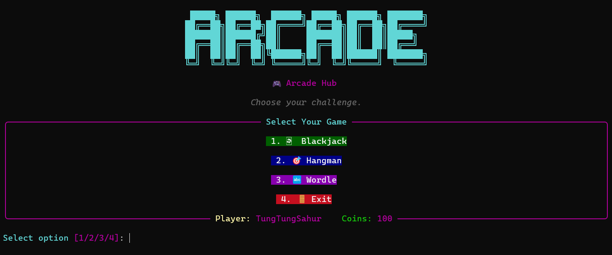

<h1 align="center">ARCADE</h1>


<p align="center"><i>Are you bored yet?</i></p>

## 📒 Table of Contents
- [💾 Installation Guide](#-installation-guide)
  - [▶️ Install from Source](#️-install-from-source)
  - [⬇️ Installing Dependencies](#️-installing-dependencies)
  - [🎮 Starting the Game](#-starting-the-game)

## 💾 Installation Guide

> ### Lengthy Guide Up Ahead
><p align="justify">As you scroll through this guide, you may feel somewhat lazy to read all of them due to amount of options that we have laid down. For the sake of simplicity, we will put the options that are understandable in layman's terms in <code>Option 1</code> and put the more technical stuff (for installation) on the other options.</p>

### ▶️ Install from Source
Let's get started! To install the game, there are two ways on how to do it:

**Option 1: Download Zip**

Clicking this [link](https://github.com/egsoliva/acm-project/archive/refs/heads/main.zip) will automatically download the zip file of the repo. You may also opt to download the it in Github by clicking on `< > Code` which can found on the right corner and click on `Download Zip`.

**Option 2: Clone the Repository**

***Note:*** This option is possible if and only if you have Git installed. For more information on how to git started ~~(pun intended)~~, check out this [link](https://github.com/git-guides/install-git) from Github.

```bash
git clone https://github.com/egsoliva/acm-project.git
```

### ⬇️ Installing Dependencies
To install the required dependencies, open your terminal and navigate to the directory where the **offline game manager** is located

```bash
cd acm-project
```

You're so close to installing the game! However, your game is missing some content and you need to install them. You have two options on how to do so:

**Option 1: Quick Installation**

Just run the following command on your terminal, make sure that you are in the directory where the offline game manager is located

```bash
python3 -m pip install -r requirements.txt
```

**Option 2: Creating a Virtual Environment**
> For more information on why you should use a virtual environment, feel free to check out this [link](https://stackoverflow.com/questions/41972261/what-is-a-virtualenv-and-why-should-i-use-one)!

Create the virtual environment
```bash
virtualenv .venv

# or
python3 -m venv .venv
```

Active .venv
```bash
# Linux
source .venv/bin/activate

# Windows
./.venv/bin/activate.ps1
```

Install dependencies
```bash
pip install -r requirements.txt
```
> Note that some modules may be need to be installed for Linux users.

### 🎮 Starting the Game

Once you have finished setting up the necessary libraries required to run the game just type this in your terminal

```bash
python3 main.py

# or
python3 -m main
```

